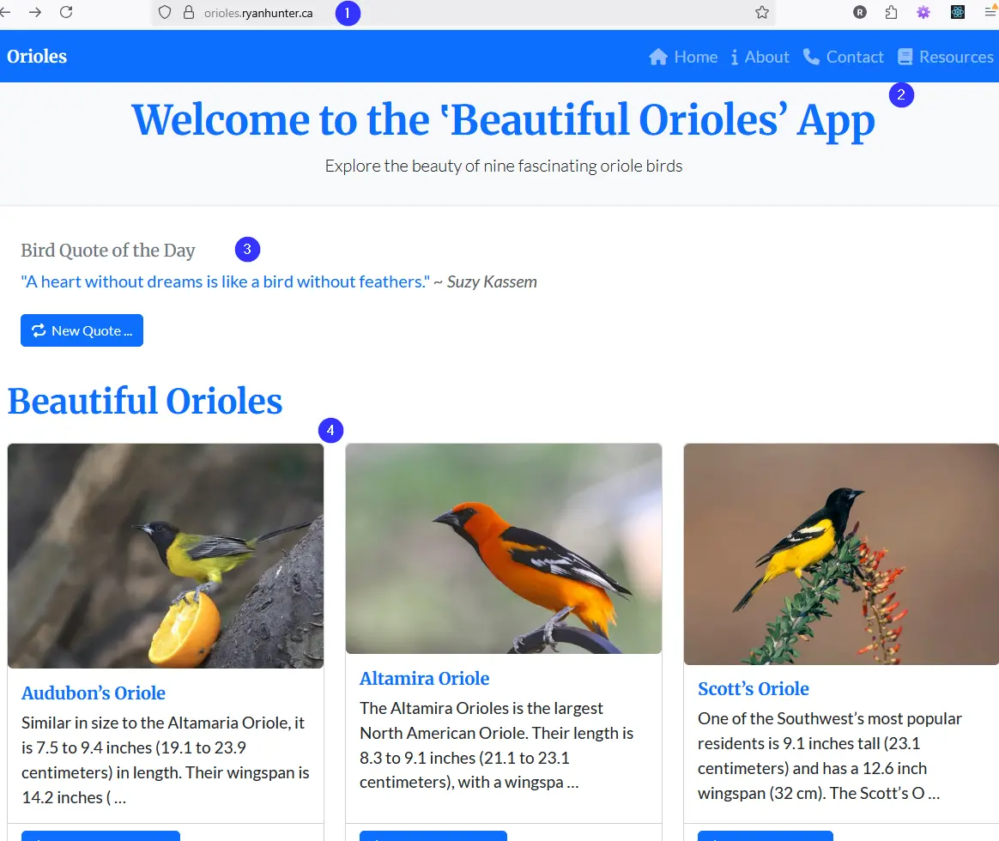

# orioles | 🐦  Beautiful Orioles
A small responsive app dedicated to beautiful orioles.  Built as a front-end portfolio coding project, using React, Typescript, Bootstrap version 5 CSS framework, FontAwesome Icons, and consumes data from 2 local TypeScript data files. Enjoy!  


## 📸 Preview
Live **Site Demo** ~ [Beautiful Orioles](http://orioles.ryanhunter.ca/)  🐦   

 

React and TypeScript based responsive web app showing various orioles.  Pulls data from a local TypeScript data file.  The random "Bird Quotation of the Day" script similarly pulls data from a typeScript data file. Enjoy!  🐦  


 

## 🔧 Built With

- React 18 + TypeScript
- Bootstrap CSS
- TypeScript data files
- React Router DOM
- FontAwesome icons
- Google Fonts


## 🚀 Getting Started (Dev)

- git clone https://github.com/systemsvanguard/orioles.git  ~ (Orioles App)    
- cd orioles 
- npm install
- npm start 
- Runs on port 5173 ---> http://localhost:5173/   
    


## License
This project is licensed under the terms of the **MIT** license.


## Screenshots 🐈  

     

     

 

    


# React + TypeScript + Vite

This template provides a minimal setup to get React working in Vite with HMR and some ESLint rules.

Currently, two official plugins are available:

- [@vitejs/plugin-react](https://github.com/vitejs/vite-plugin-react/blob/main/packages/plugin-react) uses [Babel](https://babeljs.io/) for Fast Refresh
- [@vitejs/plugin-react-swc](https://github.com/vitejs/vite-plugin-react/blob/main/packages/plugin-react-swc) uses [SWC](https://swc.rs/) for Fast Refresh

## Expanding the ESLint configuration

If you are developing a production application, we recommend updating the configuration to enable type-aware lint rules:

```js
export default tseslint.config({
  extends: [
    // Remove ...tseslint.configs.recommended and replace with this
    ...tseslint.configs.recommendedTypeChecked,
    // Alternatively, use this for stricter rules
    ...tseslint.configs.strictTypeChecked,
    // Optionally, add this for stylistic rules
    ...tseslint.configs.stylisticTypeChecked,
  ],
  languageOptions: {
    // other options...
    parserOptions: {
      project: ['./tsconfig.node.json', './tsconfig.app.json'],
      tsconfigRootDir: import.meta.dirname,
    },
  },
})
```

You can also install [eslint-plugin-react-x](https://github.com/Rel1cx/eslint-react/tree/main/packages/plugins/eslint-plugin-react-x) and [eslint-plugin-react-dom](https://github.com/Rel1cx/eslint-react/tree/main/packages/plugins/eslint-plugin-react-dom) for React-specific lint rules:

```js
// eslint.config.js
import reactX from 'eslint-plugin-react-x'
import reactDom from 'eslint-plugin-react-dom'

export default tseslint.config({
  plugins: {
    // Add the react-x and react-dom plugins
    'react-x': reactX,
    'react-dom': reactDom,
  },
  rules: {
    // other rules...
    // Enable its recommended typescript rules
    ...reactX.configs['recommended-typescript'].rules,
    ...reactDom.configs.recommended.rules,
  },
})
```
